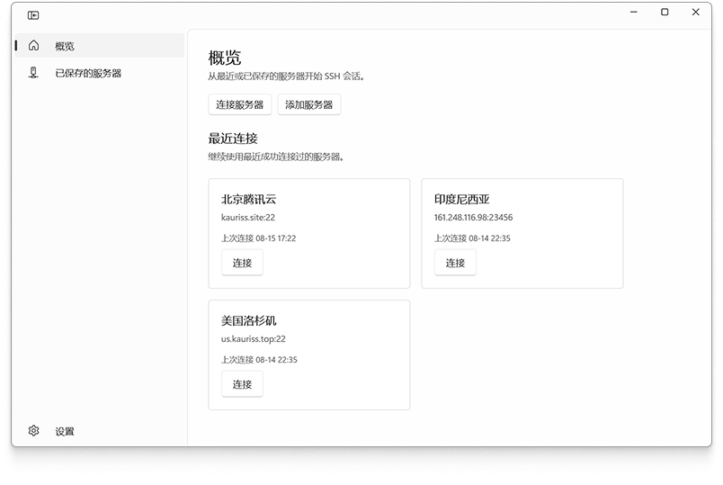
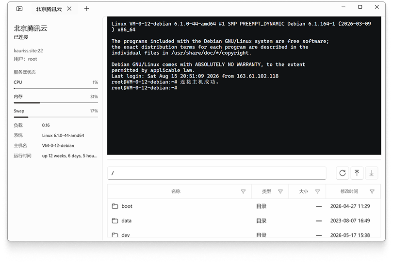

# FluentShell

<div align="center">


**现代化的 Windows SSH 客户端**

一款为 Windows 10/11 设计的原生 SSH 终端和 SFTP 文件管理工具

[特性](#特性) • [快速开始](#快速开始) • [构建](#构建) • [架构](#架构) • [贡献](#贡献)

</div>

---

## 截图

### 主界面


### 应用截图


---

## 特性

### 终端模拟
- **基于 xterm.js** - 完整的 ANSI/VT 序列支持
- **会话管理** - 多标签页同时连接多个服务器
- **实时指标** - 服务器 CPU、内存、负载监控
- **响应式布局** - 适配不同窗口尺寸和 DPI

### SFTP 文件管理
- **双通道架构** - 文件浏览和传输互不阻塞
- **可视化传输队列** - 实时查看文件传输状态、速度、剩余时间
- **批量操作** - 多文件上传/下载，智能冲突解决
- **路径验证** - 服务端路径安全检查
- **Syncfusion DataGrid** - 高性能文件列表，支持排序和筛选

### 安全认证
- **密码认证** - 支持保存到 Windows 凭据管理器
- **私钥认证** - 支持 OpenSSH 格式私钥（RSA, ECDSA, Ed25519）
- **实时验证** - 私钥文件格式即时检查，口令要求自动识别
- **重复检测** - 创建配置时警告重复的服务器
- **主机指纹** - 首次连接时验证，防止中间人攻击

### 用户体验
- **原生 WinUI 3** - 流畅的 Windows 11 风格界面
- **主题支持** - 浅色、深色、跟随系统
- **Mica/亚克力背景** - 现代材质效果
- **连接管理** - 服务器配置保存、最近连接记录
- **可取消操作** - 连接、传输均可随时取消

---

## 快速开始

### 系统要求
- **操作系统**: Windows 10 1809+ / Windows 11
- **运行时**: .NET 8 Runtime
- **架构**: x64

### 安装
1. 下载最新版本的安装包
2. 运行安装程序
3. 启动 FluentShell

### 首次使用
1. **添加服务器**
   - 点击"添加服务器"按钮
   - 填写主机地址、端口、用户名
   - 选择认证方式（密码或私钥）
   - 可选：勾选"保存凭据"避免重复输入

2. **连接服务器**
   - 在服务器列表中双击服务器卡片
   - 或点击"连接"按钮
   - 首次连接会要求确认主机指纹

3. **使用终端**
   - 连接成功后自动打开终端
   - 支持完整的 shell 交互
   - 窗口调整时自动同步终端尺寸

4. **传输文件**
   - 切换到"文件"标签页
   - 使用工具栏上传/下载文件
   - 在传输面板查看实时进度

---

## 构建

### 开发环境
- **IDE**: Visual Studio 2022 17.8+ 或 Rider
- **SDK**: .NET 8 SDK
- **工具链**: Windows App SDK 1.5+

### 构建步骤

```bash
# 克隆仓库
git clone https://github.com/Kaurisss/FluentShell.git
cd FluentShell

# 还原依赖
dotnet restore

# 构建项目（必须指定 x64）
dotnet build -a x64 -c Release

# 运行测试
dotnet test

# 运行应用
dotnet run -a x64
```

### 常见问题

**Q: 为什么必须指定 `-a x64`？**  
A: Windows App SDK 的 `WindowsAppSDKSelfContained` 特性要求显式指定架构。

**Q: 构建失败提示找不到 `win-AnyCPU.pubxml`？**  
A: 这是一个警告，不影响构建。可以忽略。

**Q: WebView2 相关错误？**  
A: 确保已安装 WebView2 Runtime（Windows 11 已内置）。

---

## 架构

### 核心组件

```
FluentShell/
├── Application/              # 业务逻辑层
│   ├── ShellCoordinator      # 连接和会话协调器
│   ├── SessionConnection     # SSH 连接生命周期管理
│   ├── SftpSessionController # SFTP 操作控制器
│   ├── SftpWorkspace         # SFTP 工作区
│   └── TransferQueueManager  # 传输队列管理
├── Services/                 # 基础服务
│   ├── SshConnectionService  # SSH.NET 封装
│   ├── SftpFileService       # SFTP 文件操作
│   ├── LocalStore            # 本地数据持久化
│   ├── CredentialService     # Windows 凭据管理
│   ├── PrivateKeyValidator   # 私钥验证
│   └── ServerProfileValidator # 配置重复检测
├── Views/                    # UI 层
│   ├── Shell/                # 主窗口和页面
│   ├── Session/              # 会话视图
│   ├── Dialogs/              # 对话框
│   └── Converters/           # 值转换器
├── Models/                   # 数据模型
└── Tests/                    # 单元测试
```

### 设计模式

**协调器模式** - `ShellCoordinator` 作为中央协调器管理服务器配置、会话和设置

**状态机** - `SessionConnection` 使用显式状态机管理连接生命周期

**双通道架构** - SFTP 使用独立的浏览和传输连接，避免 UI 阻塞

**快照模式** - 不可变快照（`SftpSessionSnapshot`）在线程间安全传递状态

**事件驱动** - 组件间通过事件解耦，支持异步更新

### 关键技术

- **WinUI 3** - 原生 Windows UI 框架
- **xterm.js** - 终端模拟器（通过 WebView2）
- **SSH.NET** - SSH/SFTP 协议实现
- **Syncfusion DataGrid** - 高性能数据网格
- **Windows App SDK** - 现代 Windows 应用平台

---

## 数据存储

### 配置文件
```
%LOCALAPPDATA%\FluentShell\
├── profiles.json          # 服务器配置（不含凭据）
└── settings.json          # 应用设置
```

### 凭据存储
- 密码和私钥口令保存在 **Windows 凭据管理器**
- 使用服务器 ID 作为凭据标识符
- 支持用户随时删除已保存的凭据

### 私钥文件
- 用户自行管理私钥文件（通常在 `%USERPROFILE%\.ssh`）
- 应用仅存储私钥文件路径，不复制或缓存私钥内容
- 支持带口令和无口令的私钥

---

## 贡献

我们欢迎各种形式的贡献！

### 报告问题
- 使用 [Issues](https://github.com/Kaurisss/FluentShell/issues) 报告 Bug
- 提供详细的复现步骤
- 附上系统信息和日志

### 提交代码
1. Fork 本仓库
2. 创建特性分支 (`git checkout -b feature/amazing-feature`)
3. 提交修改 (`git commit -m 'feat: add amazing feature'`)
4. 推送到分支 (`git push origin feature/amazing-feature`)
5. 创建 Pull Request

### 开发规范
- 遵循现有代码风格
- 为新功能添加测试
- 更新相关文档
- 提交信息遵循 [Conventional Commits](https://www.conventionalcommits.org/)

### 测试
```bash
# 运行所有测试
dotnet test

# 运行特定测试
dotnet test --filter "FullyQualifiedName~PrivateKeyValidator"

# 生成覆盖率报告
dotnet test --collect:"XPlat Code Coverage"
```

---

## 路线图

查看 [BACKLOG.md](BACKLOG.md) 了解计划中的功能：

**第一版收尾**
- ✅ SFTP 传输速度和剩余时间显示
- ✅ 多文件传输队列可视化
- ✅ 私钥文件验证和重复检测
- 🚧 主机指纹管理
- 🚧 视觉回归测试

**P1 核心增强**
- 终端模拟器增强（vim、鼠标事件、URL 识别）
- 自动重连
- 目录传输（递归上传/下载）
- 断点续传
- 传输速度限制

**P2 高级功能**
- 跳板机支持
- 端口转发
- 服务器分组
- 多终端分屏
- 双栏文件管理器
- 远程文件编辑

---

## 许可证

本项目采用 [MIT License](LICENSE)。

---

## 致谢

本项目使用了以下开源项目：

- [SSH.NET](https://github.com/sshnet/SSH.NET) - SSH/SFTP 协议实现
- [xterm.js](https://github.com/xtermjs/xterm.js) - 终端模拟器
- [Syncfusion Community Edition](https://www.syncfusion.com/products/communitylicense) - DataGrid 组件
- [BouncyCastle](https://www.bouncycastle.org/) - 加密算法库

查看 [THIRD-PARTY-NOTICES.md](THIRD-PARTY-NOTICES.md) 了解完整的第三方许可证信息。

---

## 联系方式

- **问题反馈**: [GitHub Issues](https://github.com/Kaurisss/FluentShell/issues)

---

<div align="center">

**使用 ❤️ 和 C# 构建**

[⬆ 回到顶部](#fluentshell)

</div>
